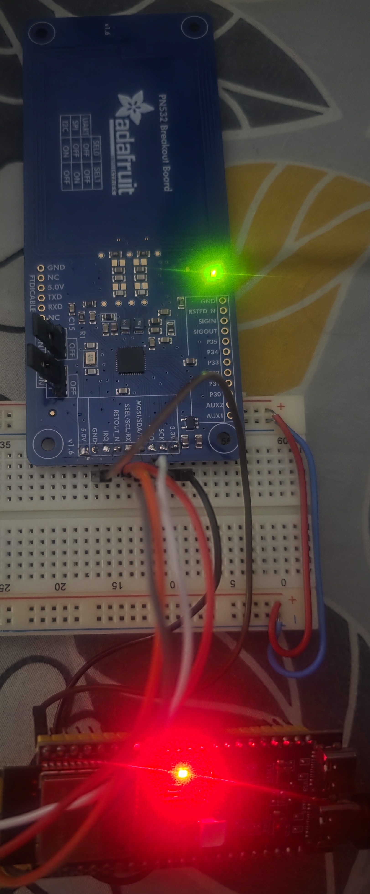

# NTAG 424 DNA Tag Provisioning System

## Overview

This system programs and validates NXP NTAG 424 DNA NFC tags using an ESP32-S3 microcontroller and a PN532 NFC reader. Each tag gets unique random cryptographic keys and a secret, enabling secure authentication and anti-counterfeiting verification.



## Hardware

### Components

| Component | Description |
|-----------|-------------|
| ESP32-S3 DevKit | Microcontroller (3.3V logic, hardware AES, NVS flash storage) |
| PN532 NFC Breakout (v1.0) | 13.56 MHz NFC reader (ISO 14443-4 support) |
| NTAG 424 DNA tags | NXP secure NFC tags (AES-128 auth, file access control) |

### Wiring (SPI, direct — no level shifter needed)

| PN532 Pin | ESP32-S3 Pin |
|-----------|-------------|
| SCK | GPIO 12 |
| MOSI | GPIO 11 |
| MISO | GPIO 13 |
| SSEL | GPIO 10 |
| 3.3V IN | 3.3V |
| GND | GND |

**PN532 switch setting:** SEL0=OFF, SEL1=ON (SPI mode)

No level shifter is needed — ESP32-S3 is natively 3.3V.

### Alternative: Arduino Uno + PN532 (for basic UID reading only)

| PN532 Pin | CD4050 Pin | Arduino Pin |
|-----------|-----------|-------------|
| SCK | Out (pin 10) ← In (pin 9) | 2 |
| MOSI | Out (pin 12) ← In (pin 11) | 3 |
| SSEL | Out (pin 15) ← In (pin 14) | 4 |
| MISO | Direct (no buffer) | 5 |
| 3.3V | — | 3.3V |
| GND | — | GND |

CD4050 VDD (pin 1) → 3.3V, VSS (pin 8) → GND. Notch at top.

## Software

### Libraries Required

- **SPI** (included with ESP32 Arduino core)
- **Preferences** (included with ESP32 Arduino core)
- **mbedtls** (included with ESP32 Arduino core — provides AES-128 and CMAC)

No external libraries needed.

### Arduino IDE Settings

| Setting | Value |
|---------|-------|
| Board | ESP32S3 Dev Module |
| USB CDC On Boot | Enabled |
| Upload Speed | 921600 |
| Flash Size | 4MB |
| Partition Scheme | Default |

### Upload

1. Open `esp32s3_ntagdna_provision.ino` in Arduino IDE
2. Select board: Tools → Board → ESP32S3 Dev Module
3. Select port
4. Upload

## Usage

Open Serial Monitor at **115200 baud**. Menu:

```
Commands:
  [P] Program tag
  [V] Validate tag
  [D] Dump/export records
  [I] Import/insert a tag record
  [C] Tag count
  [X] Erase all records
```

### Program a Tag (P)

1. Type `P` and press Enter
2. Place a **fresh** (factory default) NTAG 424 DNA tag on the reader
3. The system will:
   - Authenticate with factory default key
   - Change Key 0 (AppMasterKey) → random
   - Change Key 1 (Read key) → random
   - Change Key 2 (Write key) → random
   - Set file access rights (Read=Key1, Write=Key2, Change=Key0)
   - Write a random 16-byte secret to File 02
   - Store all keys + secret in ESP32 NVS flash

### Validate a Tag (V)

1. Type `V` and press Enter
2. Place a programmed tag on the reader
3. The system will:
   - Look up the UID in the database
   - Authenticate with stored Key 1 (read key) — **this IS the challenge-response**
   - Read the secret from the protected file
   - Compare to the stored secret

**If authentication succeeds** → the tag cryptographically proved it holds the correct key. This is a mutual 3-pass AES-128 challenge-response (ISO/IEC 9798-4).

### Export Records (D)

Prints all tag records as pretty-printed JSON:

```json
[
  {
    "uid":    "04AABBCCDD1122",
    "key0":   "F39398FB01BFAE0E51ABFA371125EB66",
    "key1":   "77056C11FE413FC1FE0078F540C3F78A",
    "key2":   "323433889A80BD0895B9A773B3747DF9",
    "secret": "7E8FD5EF28CADD2130965D6ACB295E58"
  }
]
```

**Back up this data!** If the ESP32 flash is erased, you lose access to programmed tags.

### Import a Record (I)

Manually add a tag record (e.g., from a backup):

```
UID (14 hex chars): 04186882E51690
Key 0 (32 hex chars): F39398FB01BFAE0E51ABFA371125EB66
Key 1 (32 hex chars, or 0 for default): 0
Key 2 (32 hex chars, or 0 for default): 0
Secret (32 hex chars, or 0 if none): 0
```

### Erase Database (X)

Wipes all stored records from NVS. Requires confirmation.

## Security Model

### Per-Tag Key Structure

| Key | Role | Permissions |
|-----|------|-------------|
| Key 0 (AppMasterKey) | Admin | Change any key, change file permissions, read, write |
| Key 1 (Read) | Reader | Read the secret from File 02 |
| Key 2 (Write) | Writer | Write data to File 02 |

All keys are **random** (16 bytes from ESP32 hardware RNG) and **unique per tag**.

### Access Control (after programming)

| Action | Without keys | Key 1 | Key 2 | Key 0 |
|--------|-------------|-------|-------|-------|
| Read file | ✗ | ✓ | ✗ | ✓ |
| Write file | ✗ | ✗ | ✓ | ✓ |
| Change keys | ✗ | ✗ | ✗ | ✓ |
| Change permissions | ✗ | ✗ | ✗ | ✓ |

### Authentication Protocol

The NTAG 424 DNA uses **AuthenticateEV2First** — a 3-pass mutual AES-128 challenge-response:

```
Reader                              Tag
  │ "Auth with Key 1"                 │
  ├──────────────────────────────────►│
  │                                   │
  │ E(Key1, RndB)     ← Challenge    │
  │◄──────────────────────────────────┤
  │                                   │
  │ E(Key1, RndA||RndB')  → Response │
  ├──────────────────────────────────►│
  │                                   │ Verifies RndB' ✓
  │ E(Key1, TI||RndA')    ← Proof   │
  │◄──────────────────────────────────┤
  │ Verifies RndA' ✓                  │
  │ MUTUAL AUTH COMPLETE              │
```

Neither the key nor the secret ever travels over the air in plaintext.

### Post-Authentication Secure Messaging

After authentication, all commands use **EV2 Secure Messaging**:
- **Session keys** derived from the authentication handshake (SessAuthENCKey, SessAuthMACKey)
- **Encryption** (AES-128-CBC) for sensitive data
- **CMAC** (8-byte truncated) on every command for integrity
- **Command counter** prevents replay attacks

## Data Storage

- **On ESP32:** NVS (Non-Volatile Storage) in flash. Survives reboots. Erased only by explicit erase or flash wipe.
- **Per tag:** 64 bytes (Key0 + Key1 + Key2 + Secret)
- **Capacity:** ~100+ tags depending on NVS partition size

### IMPORTANT: Backup

If the ESP32 dies or flash is corrupted, **all keys are lost permanently** — you cannot recover access to programmed tags. Always export records with `D` and save the JSON somewhere secure.

## Re-Programming

When programming a tag that's already in the database:

| Option | Key 0 | Key 1 | Key 2 | Secret |
|--------|-------|-------|-------|--------|
| **F** (Full) | New random | New random | New random | New random |
| **R** (Rotate) | Unchanged | New random | New random | New random |
| **N** (Cancel) | — | — | — | — |

## Known Limitations

1. **ChangeFileSettings** may fail if the file's current CommMode differs from expected.
2. **No SDM (Secure Dynamic Messaging)** — not needed per requirements.
3. **Single reader** — no concurrent access support.
4. **NVS capacity** — approximately 100 tags depending on partition size.

## Security Hardening

- **Random keys**: All keys generated via ESP32 hardware TRNG (`esp_fill_random`)
- **ChangeKey format**: Proper XOR + CRC32 for changing non-authenticated key slots
- **Response MAC verification**: Read, Write, and ChangeKey responses are MAC-verified to detect tampering
- **Secure zeroing**: All key material is wiped from stack memory after use (`secure_zero` with volatile pointer to prevent compiler optimization)
- **Constant-time comparison**: MAC and secret comparisons use XOR-accumulator to prevent timing side-channels
- **No hardcoded secrets**: Only the NXP factory default key (all zeros, publicly documented) is in the code

## Troubleshooting

| Symptom | Cause | Fix |
|---------|-------|-----|
| "PN532 not found" | Wiring or SPI switches wrong | Check SSEL, verify SEL0=OFF SEL1=ON |
| Auth fails on fresh tag | Tag not NTAG 424 DNA | Check tag is NT4H2421Gx |
| Auth fails on programmed tag | Wrong key in DB | Re-import correct key with `I` |
| ESP32 boot-loops | Flash corrupted or pin conflict | Hold BOOT, plug USB, upload, press RST |
| "0x7E" LENGTH_ERROR | Command data too long | Known issue with encrypted writes |
| "0x1E" INTEGRITY_ERROR | Wrong MAC | Session key or MAC calculation issue |
| "0xAE" AUTH_ERROR | Wrong key or session expired | Re-tap tag to restart session |

## File Structure

```
esp32s3_ntagdna_provision/
├── esp32s3_ntagdna_provision.ino  — Complete single-file sketch
├── README.md                      — This documentation
└── 749670.jpg                     — Hardware setup photo
```

## Protocol Reference

- NXP NT4H2421Gx datasheet (NTAG 424 DNA)
- NXP AN12196 — NTAG 424 DNA and NTAG 424 DNA TagTamper features and hints
- ISO/IEC 14443-4 — Transmission protocol (ISO-DEP)
- ISO/IEC 7816-4 — APDU command structure
- NIST SP 800-38B — CMAC
- ISO/IEC 9797-1 Method 2 — Padding
