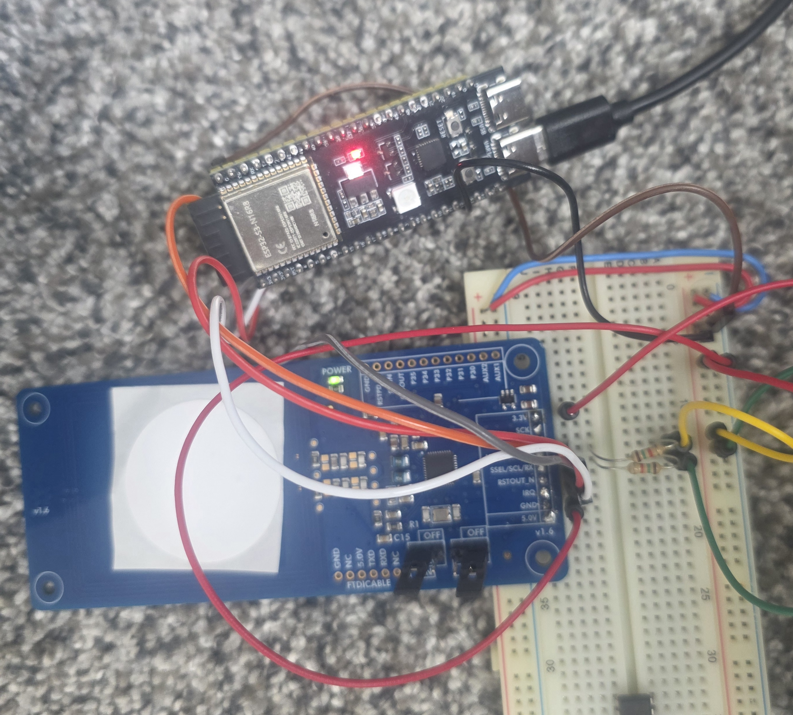

# NTAG 424 DNA Tag Provisioning System (I2C)

## Overview

This system programs and validates NXP NTAG 424 DNA NFC tags using an ESP32-S3 microcontroller and a PN532 NFC reader over I2C. Each tag gets unique random cryptographic keys and a secret, enabling secure authentication and anti-counterfeiting verification.



## Hardware

### Components

| Component | Description |
|-----------|-------------|
| ESP32-S3 DevKit | Microcontroller (3.3V logic, hardware AES, NVS flash storage) |
| PN532 NFC Breakout (v1.0) | 13.56 MHz NFC reader (ISO 14443-4 support) |
| NTAG 424 DNA tags | NXP secure NFC tags (AES-128 auth, file access control) |
| 2× 1.5KΩ resistors | I2C pull-ups (SDA and SCL to 3.3V) |

### Wiring (I2C with pull-ups — no level shifter needed)

| PN532 Pin | ESP32-S3 Pin | Notes |
|-----------|-------------|-------|
| SDA | GPIO 8 | + 1.5KΩ pull-up to 3.3V |
| SCL | GPIO 9 | + 1.5KΩ pull-up to 3.3V |
| IRQ | GPIO 7 | Active LOW when data ready |
| RSTO | GPIO 6 | Hardware reset (optional) |
| 3.3V | 3.3V | |
| GND | GND | |

**PN532 switch setting:** SEL0=ON, SEL1=OFF (I2C mode)

No level shifter is needed — ESP32-S3 is natively 3.3V.

### Pull-up Resistors

The PN532 breakout does NOT include I2C pull-ups. You must add two 1.5KΩ resistors:

```
                3.3V                    3.3V
                 │                       │
              [1.5KΩ]                 [1.5KΩ]
                 │                       │
ESP32 GPIO8 ────┼──── PN532 SDA   ESP32 GPIO9 ────┼──── PN532 SCL
```

Each resistor connects from the signal line (shared node between ESP32 and PN532) up to 3.3V.

### Important Notes

- **Power-cycle after switch change**: The PN532 reads switch settings at power-up only. After changing switches from SPI to I2C, disconnect and reconnect 3.3V.
- **GPIO 11-14 are unsafe** on many ESP32-S3 boards (used for PSRAM/flash). This sketch uses GPIO 6-9 which are safe on all variants.

## Software

### Libraries Required

- **Wire** (included with ESP32 Arduino core)
- **Preferences** (included with ESP32 Arduino core)
- **mbedtls** (included with ESP32 Arduino core — provides AES-128 and CMAC)

No external libraries needed.

### Arduino IDE Settings

| Setting | Value |
|---------|-------|
| Board | ESP32S3 Dev Module |
| USB CDC On Boot | Disabled |
| Upload Speed | 921600 |
| Flash Size | 4MB |
| Partition Scheme | Default |

### Upload

1. Open `esp32s3_ntagdna_provision_i2c.ino` in Arduino IDE
2. Select board: Tools → Board → ESP32S3 Dev Module
3. Select port
4. Upload
5. Open Serial Monitor at **115200 baud**

## Usage

Same as the SPI version. Menu:

```
Commands:
  [P] Program tag
  [V] Validate tag
  [D] Dump/export records
  [I] Import a tag record
  [C] Tag count
  [X] Erase all records
  [T] Reset tag to factory
```

### Program a Tag (P)

1. Type `P` and press Enter
2. Place a **fresh** (factory default) NTAG 424 DNA tag on the reader
3. The system will:
   - Authenticate with factory default key (all zeros)
   - Change Key 0 (AppMasterKey) → random
   - Re-authenticate with new Key 0
   - Change Key 1 (Read key) → random
   - Change Key 2 (Write key) → random
   - Write a random 16-byte secret to File 02 (encrypted)
   - Set file access rights with CommMode.Full (Read=Key1, Write=Key2, Change=Key0)
   - Store all keys + secret in ESP32 NVS flash

**Important:** Tags must be in factory-default state (all keys = zeros) for first programming. The ChangeKey command requires knowledge of the current key value.

### Validate a Tag (V)

1. Type `V` and press Enter
2. Place a programmed tag on the reader
3. The system will:
   - Look up the UID in the database
   - Authenticate with stored Key 1 (read key) — mutual AES-128 challenge-response
   - Read the secret from the protected file (decrypted from CommMode.Full)
   - Compare to the stored secret

Neither the key nor the secret ever travels over the air in plaintext.

### Export Records (D)

Prints all tag records as JSON. **Back up this data!**

### Reset Tag (T)

Factory-resets all keys and file settings. Requires the stored keys to match.

## Security Model

### Per-Tag Key Structure

| Key | Role | Permissions |
|-----|------|-------------|
| Key 0 (AppMasterKey) | Admin | Change any key (must know current), change file permissions |
| Key 1 (Read) | Reader | Read the secret from File 02 |
| Key 2 (Write) | Writer | Write data to File 02 |

All keys are **random** (16 bytes from ESP32 hardware RNG) and **unique per tag**.

### CommMode.Full

File 02 is configured with CommMode.Full — all data is AES-128-CBC encrypted and CMAC'd on the air. An RF eavesdropper cannot extract the secret even by capturing the complete NFC exchange.

### Authentication Protocol

The NTAG 424 DNA uses **AuthenticateEV2First** — a 3-pass mutual AES-128 challenge-response (ISO/IEC 9798-4). Session keys are derived per-authentication, and a command counter prevents replay attacks.

## Data Storage

- **On ESP32:** NVS (Non-Volatile Storage) in flash. Survives reboots and re-uploads.
- **Per tag:** 64 bytes (Key0 + Key1 + Key2 + Secret)
- **Capacity:** ~100+ tags depending on NVS partition size

### IMPORTANT: Backup

If the ESP32 dies or flash is corrupted, **all keys are lost permanently**. Always export records with `D` and save the JSON somewhere secure.

## Troubleshooting

| Symptom | Cause | Fix |
|---------|-------|-----|
| "PN532 not found" | I2C not working | Check pull-ups, switches (SEL0=ON, SEL1=OFF), power-cycle PN532 |
| No serial output | USB CDC setting wrong | Set USB CDC On Boot = Disabled, use UART port |
| I2C scan finds nothing | Switches not read | Power-cycle the PN532 after changing switches |
| Auth fails on fresh tag | Tag not NTAG 424 DNA | Check tag is NT4H2421Gx |
| "0x1E" INTEGRITY_ERROR | OldKey mismatch | DB key doesn't match tag; factory reset with `T` |
| "0xAE" AUTH_ERROR | Session expired | Re-tap tag to restart |
| Boot loop | GPIO conflict | Ensure no .ino files share a folder |

## File Structure

```
esp32s3_ntagdna_provision_i2c/
├── esp32s3_ntagdna_provision_i2c.ino  — Complete single-file sketch (I2C)
├── README.md                          — This documentation
└── 767325.jpg                         — Hardware setup photo
```

## Protocol Reference

- NXP NT4H2421Gx datasheet (NTAG 424 DNA)
- NXP AN12196 — NTAG 424 DNA and NTAG 424 DNA TagTamper features and hints
- ISO/IEC 14443-4 — Transmission protocol (ISO-DEP)
- ISO/IEC 7816-4 — APDU command structure
- NIST SP 800-38B — CMAC
- ISO/IEC 9797-1 Method 2 — Padding
